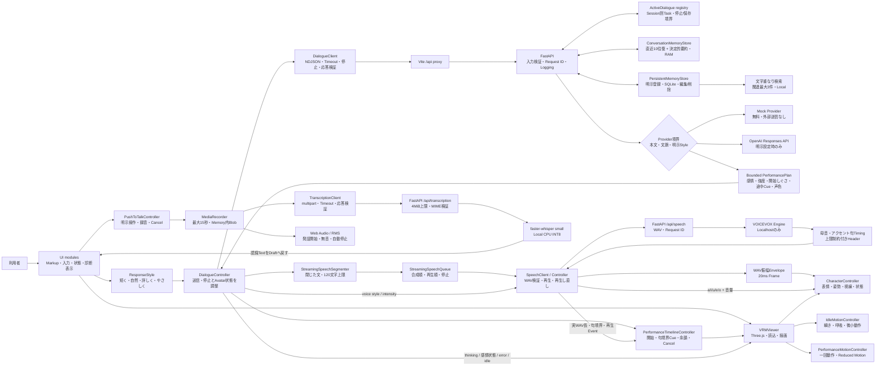
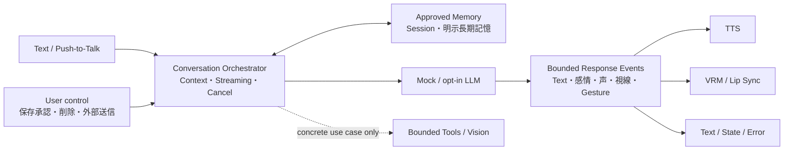

# Architecture

更新日: 2026-08-25 / 対象Version: v0.4 + Voice + Local Memory + Adaptive Performance + Adaptive Interaction + Cancellation + Streaming

## 現在の構成



現在はFrontend、Backendに加えて、音声出力を試す場合だけローカルVOICEVOX Engineを起動する構成である。音声入力はBackend process内のfaster-whisperを使う。Session別の短期履歴と要約、所有者が管理するSQLite長期記憶がある。認証、Tools、Vision、Embedding/RAGはない。

## 主要な処理の流れ

1. `UIController`がTextと明示選択した4種類の返答スタイルを受け取り、空文字・1000文字超・処理中の再送を防ぐ。
2. `DialogueController`が利用者発話を表示し、Avatarを`thinking`へ変える。
3. `DialogueClient`が画面内で生成した`session_id`、本文、`response_style`を`POST /api/dialogue/stream`へ送り、`application/x-ndjson`の`start -> text_delta* -> complete | error`を検証する。35秒でClient Timeoutにし、生成中の送信Buttonは`応答を停止`へ変わり、操作時は`DELETE /api/dialogue/sessions/{session_id}/active`を送る。
4. FastAPIがPydanticで入力を検証し、Request IDを発行する。同じSessionの生成Taskを一つだけ`ActiveDialogue` Registryへ登録し、重複生成を409で拒否する。
5. `ConversationMemoryStore`から同じSessionの直近履歴と要約を取り出し、`PersistentMemoryStore`から入力に文字列上関連する最大3件を検索する。
6. Context Dataを命令ではなく参照情報として区切り、`response_style`を固定Instructionへ変換してから、`DIALOGUE_PROVIDER`に応じてMockまたはOpenAI Providerを1回呼ぶ。OpenAIは`StructuredDialogueOutput`のRaw JSON Deltaから、完全にDecodeできた`reply`文字だけを公開する。Split EscapeやUnicode Surrogateは揃うまでBufferし、`performance` JSONを画面へ流さない。
7. Browserは`text_delta`を一つの仮Assistant Messageへ追加する。同時に、`。！？!?`または改行で閉じた文だけをStreaming Speech Queueへ渡す。句読点のない長文は120文字以内で読点・空白を優先して分割し、未完の短い語句は最終応答までBufferする。
8. 停止受付と保存開始の境界を排他制御する。停止を受け付けた場合はProvider Stream TaskをCancelし、仮Message、RAM履歴、明示長期記憶を破棄して`idle`へ戻す。既に保存開始へ入った場合は停止未成立として示し、成功扱いを偽らない。
9. 成功した利用者発話と最終応答だけを1往復としてRAMへ追加し、10往復を超えた古い履歴を短文要約へ圧縮する。
10. `覚えておいて：内容`に一致した成功Turnだけは、明示記憶としてSQLiteへ保存する。
11. Provider完了後、PydanticとFrontendで最終本文と、許可済みEnum・0〜1強度・開始しぐさ1件・途中Cue最大2件の`PerformancePlan`を再検証し、仮Messageを確定する。本文は常に`textContent`で表示し、途中Deltaと最終本文が異なる場合は先行音声を破棄する。
12. VOICEVOX合成Queueと再生Queueを分け、前の文を再生中に次の閉じた文を順番に合成する。母音長を実WAV長へScaleして5口形Lip Syncを行い、最終Plan到着後にGestureとCueを適用する。停止・失敗は合成Request、未再生文、口形、予約Cueを破棄する。
13. 失敗時は仮Messageと先行音声Queueを破棄し、履歴も長期記憶も増やさず、秘密情報を含まない案内を表示して再送可能な状態へ戻す。既に再生された音声だけは取り消せない。

「新しい会話」は現在のSessionを`DELETE /api/dialogue/sessions/{session_id}`で消去してから、新しいSession IDへ切り替える。別Sessionの履歴は混ぜない。

Push-to-Talkは別経路で、利用者のButton操作後だけ`getUserMedia`を呼ぶ。録音Blobを`POST /api/transcription`へ送り、認識Textを送信せずDraftへ戻す。利用者が確認・修正した後に通常のText対話経路へ渡す。

Frontendの各Controllerは`performance.now()`でBrowser側の利用者体験時間を測り、UIの診断欄へ認識、最初のText、本文完了、音声再生開始を独立して渡す。Backend Logも初文・本文完了・Commit完了を分ける。会話本文や音声を計測用に追加保存せず、最適化対象を判断する一時表示だけを行う。

## Repository構成

```text
adaptive-vrm-dialogue-agent/
├─ frontend/
│  ├─ e2e/              # Mock一往復のPlaywright Browser test
│  ├─ src/dialogue/     # HTTP通信と対話状態
│  ├─ src/transcription/ # Push-to-Talk、録音、認識API
│  ├─ src/speech/       # VOICEVOX再生とLip Sync
│  ├─ src/ui/           # DOMと利用者向け表示
│  └─ src/vrm/          # Three.js、VRM読込、表情・姿勢・待機動作
├─ backend/
│  ├─ app/              # FastAPI、設定、Schema、Provider
│  ├─ scripts/          # Model準備と固定Scenario評価
│  └─ tests/            # API、Provider、Speech、MemoryのTest
├─ docs/
│  ├─ assets/           # 公開可能なScreenshot
│  └─ evaluations/      # 評価結果とFailure Case
├─ .github/workflows/   # Clean installで実行するCI
├─ setup.ps1            # Windows初回Setup
├─ start_demo.ps1       # Frontend/Backend統合起動
├─ README.md            # 起動と利用手順
├─ PROJECT_DIRECTION.md # Product目的、現状判断、Scope
├─ ARCHITECTURE.md      # 現在のSystem構成
├─ DEVELOPMENT_ROADMAP.md # Release Gateと評価計画
├─ SECURITY.md          # Local運用のSecurity境界
└─ THIRD_PARTY_NOTICES.md # Dependency、Voice、VRM条件
```

## 境界と責務

| 境界 | 任せること | 任せないこと |
| --- | --- | --- |
| createAppMarkup | 静的DOM、初期Label、入力Controlの構造 | Event、通信、状態変更 |
| UIController | Event調整、状態、返答スタイル選択、送信/停止Button、短いエラー、Accessibility | Provider固有処理、APIキー、静的Markup生成 |
| renderDeveloperPanel | 診断用ViewModelのDOM描画 | Viewer/Providerの状態所有 |
| Latency表示 | 各Controllerが測った直近のBrowser往復時間を整形 | 永続保存、同一Turnの合計とみなすこと |
| DialogueController | Busy、生成停止、状態遷移、表示順序、Session IDと返答スタイルのSession内保持 | HTTP詳細、会話本文と返答スタイルの永続保存 |
| DialogueClient | POST NDJSON、Network Chunk再構成、Event/最終応答検証、Timeout、生成停止、公開Error | Avatar制御、Provider選択、Raw JSON表示 |
| SpeechClient / Controller | Health、WAV検証、母音/句Timing検証、Object URL、再生・停止・再再生、制限付き再生速度 | 話者選択UI、本格感情音声 |
| StreamingSpeechSegmenter / Queue | 閉じた文、合成/再生順序、最終本文一致、Abort、Replay Cache | Memory Commit、未完語句の発話、上流VOICEVOX処理の停止保証 |
| LipSyncController | PCM振幅、VOICEVOX 5母音、再生時刻同期、平滑化、停止Reset | 子音専用口形、録音音声の音素推定 |
| PushToTalkController | 明示操作、Permission、マイク列挙・Session内選択、録音、自動/手動停止、Cancel、Draft反映 | 自動送信、永続録音、Device IDの永続保存 |
| VoiceActivityMonitor | Web Audioの時間波形、RMS、発話開始、約1秒無音、5秒無発話 | 音声認識、感情・話者の推定、録音保存 |
| TranscriptionClient | multipart、Timeout、JSON検証、公開Error | マイク制御、対話送信 |
| FastAPI | 入力と返答スタイル検証、Request ID、Session別Active Task、停止/保存境界、Provider呼出、観測可能Log | UI、永続会話 |
| ConversationMemoryStore | Session分離、直近10往復、決定的要約、Reset、最大Session数 | Disk保存、意味検索、個人Profile |
| PersistentMemoryStore | SQLite CRUD、明示保存、重複防止、文字重なり検索 | 暗号化、Embedding、通常会話の自動保存 |
| Provider | Mock/OpenAI差異の吸収、明示Style適用、reply Delta・最終本文・制限付きPerformancePlan・任意Token使用量の生成 | 利用者能力の推定、Tool、履歴の所有、自由形式のAvatar命令 |
| OpenAI評価Script | 明示Gate、架空4 Turn/Text/Speech Streaming、Request上限、段階Latency・Token・費用Snapshot・停止Probe | API Key・本文・WAV出力、実Data、一般化性能の主張、自動定期実行 |
| Speech Provider | VOICEVOXの2段階API、Timeout、WAV検証 | Browser再生、Lip Sync、音声ライブラリ規約の自動判定 |
| Transcription Provider | local faster-whisperの遅延Load、CPU推論、推論Lock | 録音保存、利用者確認の省略 |
| VRMViewer | Scene、Model lifecycle、描画、Fallback | AI通信、会話判断 |
| CharacterController | 許可済み状態、表情、姿勢、視線、演技強度 | 自由形式のAgent Action |
| PerformanceMotionController | 許可済み一回Gesture、強度Clamp、Reduced Motion | 任意Bone操作、Animation File実行 |
| PerformanceTimelineController | 実音声時間への開始・途中Gesture同期、余韻、停止時Cancel | 内容判断、任意Animation、Audio生成 |

この分離により、VoiceやAgentを追加しても、APIキーやProvider処理をVRM制御へ混ぜずに済む。

## UIの情報設計

- 主画面はAvatar、会話履歴、入力を常時表示する。
- 返答スタイルは会話へ直接影響するためHeaderの小さなSelectへ置き、既定値を「自然」にする。送信中は変更を無効化し、どのStyleで送ったかをTurn途中で変えない。
- 生成中は同じ送信Buttonを`応答を停止`へ切り替え、別の停止Controlを増やさない。停止成功時はAssistant本文を追加せず、履歴と長期記憶へ保存していないことを短いNoticeで示す。
- 正常な待機状態は重複表示せず、処理中、失敗、利用者の判断が必要な状態だけを会話の近くへ表示する。
- 音声設定、長期記憶、演技調整、診断情報はNative `details`による段階的開示とし、Keyboard操作を保つ。
- Providerの送信範囲など、普段の操作を妨げる長文は短いLabelのTooltipと`aria-describedby`、READMEへ分ける。
- 390px/319px幅でも会話入力を初期Viewport内へ残し、横Overflowを発生させないことをPlaywrightで確認する。
- Stageの円窓、格子、水紋、浮遊片はCSSだけで描画し、外部画像Assetを読み込まない。
- `UIController.updateState()`が設定する`#app[data-state]`を環境色の唯一の入力とし、Avatarの状態所有を重複させない。
- 環境Animationも`prefers-reduced-motion`で停止し、意味のある状態Textを装飾だけで置き換えない。

## Dataと外部通信

- Mock: 入力はBrowserとローカルBackend内だけで処理する。
- OpenAI: 所有者が`DIALOGUE_PROVIDER=openai`とAPIキーを明示した場合だけ、今回の入力Text、直近履歴、Session要約、関連長期記憶をOpenAI APIへ送る。現在は`store=False`だが、これはZero Data Retentionを意味せず、標準のAbuse Monitoring保持はOpenAI側のData Controlに従う。
- VOICEVOX: 音声化するTextをローカルEngineの`/audio_query`と`/synthesis`へ送る。接続先はLoopback HTTPだけを許可する。
- Push-to-Talk: 録音はBrowserからLoopbackのFastAPIへだけ送る。faster-whisperは端末内で推論し、録音Bytesと認識本文を永続保存・通常Log出力しない。
- Microphone選択: Permission取得後に`enumerateDevices()`で音声入力だけを列挙し、選択した`deviceId`はMemory内だけで保持する。切断時は既定へFallbackする。
- Voice activity: `createMediaStreamSource()`と`AnalyserNode`で時間波形のRMSだけをBrowser内計算する。発話後の無音で停止し、無発話はBackendへUploadしない。Noise環境では利用者が自動停止をOFFにできる。
- Log: 会話本文、Session ID、APIキーは通常Logへ残さない。Request ID、Provider、Model、返答スタイル、記憶往復数、処理時間、成功/失敗Codeだけを記録する。
- Generation cancel: Session IDはURL内でBackendへ送るが通常Logへ記録しない。停止受付、Provider Taskの終了有無、処理時間だけを記録し、停止TurnはRAM/SQLiteへ追加しない。
- VRM: Browser内のObject URLまたはローカル既定Pathから読む。外部Uploadはしない。
- Session Memory: Backend RAM内に最大32 Session、各10往復と最大8個の要約断片を保持する。ResetまたはBackend終了で消え、Diskへ保存しない。
- Long-term Memory: 明示登録した最大500文字の項目を最大200件、`backend/.local/memory.sqlite3`へ保存する。UI/APIから確認、編集、削除できる。暗号化とBackupは行わない。
- 永続Data: 明示登録した長期記憶だけSQLiteへ残る。通常会話、返答スタイル、PerformancePlan、画面上のMessageはReloadで消える。

## ErrorとFallback

| 失敗 | 現在の挙動 | 残る課題 |
| --- | --- | --- |
| VRMがない | 3D Placeholderと選択UIを表示 | Demo用モデルの再取得手順 |
| Expression/LookAt/骨がない | 利用可能な機能だけ使い警告 | Model別の見た目評価 |
| Backend停止 | 短い案内、Avatar `error`、再送可能 | 自動Health再確認、Retry button |
| APIキーなし | Appは起動し、OpenAI対話だけ503 | `.env.example`は参照用で自動読込しない |
| Provider Timeout/Rate Limit | 公開ErrorとRequest IDを表示。生成中は利用者が停止可能 | 自動Retry方針、上流計算/請求まで停止したかの確認 |
| VOICEVOX未起動/失敗 | 音声だけError表示。Text対話は継続 | Healthの自動再確認 |
| 途中Textと最終本文が不一致 | BackendでCommit拒否。Frontend防御ではQueue破棄後に確定本文を再生成 | 既に聞こえた先行音声は取り消せない |
| Browser自動再生拒否 | 生成済みWAVを残し、手動再生Buttonを表示 | Browser別の実機確認 |
| Microphone Permission拒否 | 設定案内を表示し、Text入力へ戻る | 実Browserでの手動確認 |
| 無音・不正録音 | 公開Errorを表示し、再録音またはText入力へ戻る | Noiseを含む固定Scenario評価 |
| 認識Timeout/Cancel | RequestをAbortし、録音Trackを停止 | 推論自体の途中CancelはProvider制約あり |
| 不明な返答スタイル | Backendで422、Frontendで不正応答を拒否 | Schema versioning |
| 不正なProvider応答 | Frontendで拒否 | Schema versioning |

## 採用した判断

- vanilla TypeScriptを継続: 単一画面ではReact追加の効果より依存と抽象化の増加が大きい。
- FastAPIを採用: APIキーをBrowserへ渡さず、入力検証とProvider差異を集約する。
- Mockを既定: 初回起動、Test、Demo練習で料金とNetwork依存をなくす。
- 返答スタイルは明示選択: 利用者の能力や感情を推定せず、4種類のEnumをFrontendからProviderまで通す。
- VOICEVOXを最初のTTSに採用: API利用料とCloud送信を避け、Backend境界越しに交換可能にする。
- faster-whisper `small` / CPU INT8を最初のSTTに採用: Browser固有の外部認識Serviceを避け、認識文を確認してから送信する。
- WebGLRendererを採用: WebGPUより対応範囲が安定し、現在のMToon/VRM検証に十分。
- Agent Frameworkは未採用: 単発Text応答には過剰で、失敗箇所と費用を説明しにくい。
- Runtime CDNは不使用: npm/pipでVersionを固定し、再現性とLicense確認をしやすくする。

## 現在の技術的Risk

- production JavaScriptが約870kBで、低性能PCや初回Loadに影響する可能性がある。
- Pythonの間接依存を完全固定するlock fileがなく、将来のClean installで差が出る可能性がある。
- 静的MarkupとDeveloper Panel描画は`UIController`から分離したが、対話、Memory、Model操作のEvent調整は同Classに残る。新しい主要画面を足す場合は領域別Controller化が必要。
- OpenAIの固定`Safety Identifier`はローカル単一利用者用。公開時は個人情報を含まない利用者別識別子へ変える。
- `store=False`でも標準のAbuse Monitoring Logに入力と応答が最大30日含まれ得る。機微情報を送信しない運用と、Account側Data Controlの確認が必要。
- 認証、Rate Limit、Security Header、監視がないため、Internet公開できる構成ではない。
- Full-body寄りのFramingでは、Avatarの表情がDemoで伝わりにくい場合がある。
- Local起動はWindows script中心。CIはUbuntuでTest/Buildするが、Linux/macOSの対話Demo起動は未確認。
- 通常のVOICEVOX `/synthesis`はClient切断後もEngine側処理を直ちにCancelできない。実験的なCancel APIは現段階では採用しない。
- 閉じた文は最終Schema検証前に再生できるため、既に聞こえた内容は取消不能である。最終`PerformancePlan`より早く始まる最初の文は中立速度になり得る。
- Lip SyncはVOICEVOXの5母音Timingへ対応したが、子音・撥音・促音・無声化母音は音量と近接母音で近似する。
- `small`のCPU推論は5.621秒音声で約6.8秒かかり、長い発話の即時性が弱い。実マイクとNoise評価も未完了。

## 将来構成への拡張順



目標は、自然な会話、許可された記憶、本文と身体表現の一貫性、ローカル優先の利用者制御を一つのConversation Orchestratorへ統合すること。現在は`Session Memory -> 要約 -> local永続Memory -> 軽量検索 -> 明示Adaptive Interaction -> 生成停止 -> reply-only Streaming -> 文単位Speech Queue`まで実装した。Natural Conversationの次は、v0.5 Character Identityで本文・声・身体表現の一貫性を上げるSliceを優先する。Bounded AgentやVisionは、固定処理では解けない具体的な利用Scenarioと公開可能な評価Dataを用意できた場合だけ検討する。

## 別Repositoryへ分ける条件

VisionやBackendを別Repositoryへ分けるのは、次のうち2つ以上を満たす場合に提案する。

- 独立した利用者とProduct目的がある。
- 独立したRelease/Deploy周期が必要。
- 別の認証・Secret・Data retention境界が必要。
- 大容量Model/Dataや異なる実行環境が必要。

単にPythonとTypeScriptが違う、Visionを追加した、という理由だけでは分割しない。
