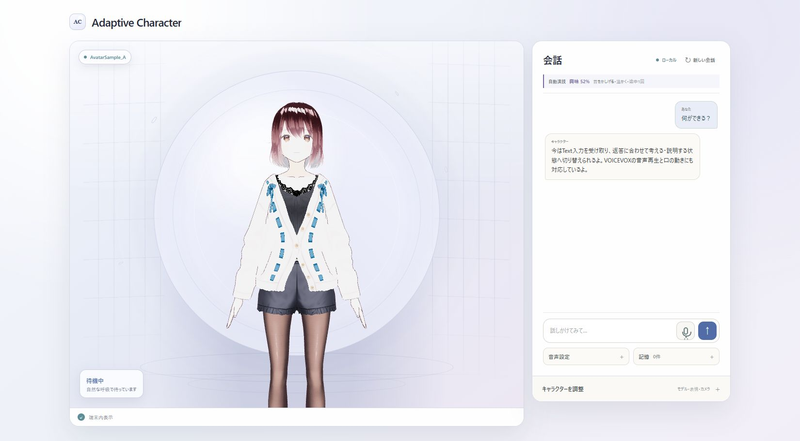
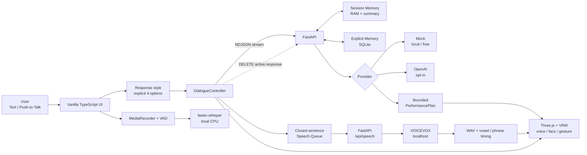

# Adaptive Character Lab

[](https://github.com/yutoo77/adaptive-vrm-dialogue-agent/actions/workflows/ci.yml)
[](LICENSE)
[](#privacyと外部通信)

Textまたは音声で話しかけると、返答に合わせてVRM Avatarが声・表情・口形・しぐさを変える、ローカル優先の対話Applicationです。

> **Product Vision:** 自然に会話でき、利用者が許可したことだけを覚え、声・表情・視線・しぐさまで一貫して反応する、ローカル優先の個人AIキャラクター。

このプロジェクトで重視したのは、AI機能の数ではありません。利用者が「聞き取り中・考え中・発話中・失敗」を理解でき、音声機能が失敗してもTextへ戻れ、保存内容と外部送信を自分で管理できる一つの体験として仕上げることです。

現在は、このVisionの基盤となるMock/OpenAI Provider境界、明示型Memory、VOICEVOX、5母音Lip Sync、制限付き表情・Gesture、明示返答スタイル、生成中の応答停止、Text Streaming、文単位の先行音声Queueまでを実装しています。実OpenAI Providerは架空Dataによる固定4 Turn、Text Streaming、実VOICEVOXを組み合わせた発話準備まで評価済みです。多様な会話での自然さ、独自Avatar、利用者評価は今後の対象であり、完成済みとは主張しません。



> Screenshot: AvatarSample_A © pixiv Inc. / pixiv VRoid Project。モデル本体はRepositoryへ含めていません。背景の円窓、格子、水紋、光はCSSとThree.jsで制作した本Project固有のStageです。

## 解決したい課題

音声、LLM、Avatarを単純につなぐだけでは、待ち時間や失敗箇所が分からず、誤認識した文がそのまま送信され、どのDataが保存・外部送信されるのかも曖昧になりがちです。

Adaptive Character Labでは、次の方針でこの問題を扱います。

- Avatarの状態と短い表示で、処理中か復帰可能かを伝える。
- 音声認識結果は自動送信せず、利用者が確認・修正できるDraftへ戻す。
- VOICEVOXが停止してもText回答を残し、対話全体を止めない。
- 生成中は送信Buttonを停止操作へ切り替え、停止したTurnを会話履歴や長期記憶へ保存しない。
- 通常会話を永続保存せず、明示登録した長期記憶だけを確認・編集・削除できるようにする。
- 自動演技へ自由なBone命令やScriptを渡さず、許可した感情・しぐさ・強度だけをSchemaで受け付ける。
- 既定のMock Providerでは料金も外部AIへの送信も発生させない。

想定利用者は、Windows PC上で技術学習・相談・考えの整理に使う日本語話者です。現在は単一利用者のローカルApplicationであり、公開Web Serviceではありません。

## Demoで確認できること

最短の確認は、起動後に `何ができるの？` と送ることです。

1. Avatarが`thinking`へ移る。
2. Backendから検証可能なText部分だけが順次表示される。
3. 最終Schema検証後、返答内容に応じた感情・強度・しぐさが確定する。
4. VOICEVOXが利用可能なら音声を再生し、5母音の口形を同期する。
5. 途中Gestureと短い余韻の後、`idle`へ復帰する。

3分版と1分版の説明順、失敗時の復帰手順は[Demo Guide](docs/DEMO.md)にまとめています。

## 主な機能

| 領域 | 実装内容 |
| --- | --- |
| 対話 | Text入力、Mock/OpenAI Provider切替、Structured Outputのreply-only Streaming、明示返答スタイル4種、生成中の応答停止、Token使用量、Timeout、Request ID |
| Voice input | Push-to-Talk、マイク選択、約1秒無音の自動停止、5秒無発話Fallback、最大15秒、認識Draft確認 |
| Voice output | ローカルVOICEVOX、閉じた文の先行合成、順序付き再生Queue、停止、再再生、Text回答を残すFallback |
| Lip Sync | VOICEVOX母音Timingを`aa / ih / ou / ee / oh`へ同期し、音量Envelopeで開口量を調整 |
| Avatar | VRM 1.0中心の読込、表情・姿勢・視線、瞬き・呼吸、モデル差異のFallback、3D Placeholder |
| Adaptive Performance | 感情6種、Gesture 4種、Voice Style 5種、強度0〜1、途中Cue最大2件の制限付きPlan |
| Memory | Session別直近10往復、決定的要約、明示登録だけのSQLite長期記憶、CRUD、文字重なり検索 |
| Visual identity | 深藍・白練・藤色を軸にしたCode-native Stage、状態連動の環境光、外部画像Assetなし |
| Accessibility / UX | `prefers-reduced-motion`対応、演技強度3段階、Keyboard focus、文脈に応じた状態表示、段階的開示 |
| Observability | 認識・初文・本文完了・発話開始の直近時間、Backend Request ID、Providerと失敗CodeのLog |

Toolを選んで実行するAgent、RAG、Vision、Internet公開はまだ実装していません。`PerformancePlan`が制限付きであることと、Tool-using Agentが完成していることは別です。

## 技術的なポイント

### 1. 一往復を最後までつなぐVertical Slice

Text/Voice入力からBackend、応答、音声、Lip Sync、表情、Gesture、停止・復帰までを独立したDemoの寄せ集めにせず、一つの状態遷移として接続しています。生成中に停止したTurnはBackendのProvider Taskまで取り消し、保存開始との境界を排他制御して、Session履歴と明示長期記憶へ追加しません。音声生成に失敗してもText対話は成功として残ります。

Textは`POST /api/dialogue/stream`のNDJSONで順次表示します。OpenAIのStructured JSONをそのまま見せず、`reply`文字列の安全にDecodeできた部分だけをDeltaとして送ります。演技とMemoryは最終Pydantic検証後だけ確定し、途中停止や接続失敗では仮Messageを破棄するため、見えた途中Textが保存済みに見える状態を残しません。

閉じた文だけは`StreamingSpeechSegmenter`から`StreamingSpeechQueue`へ渡し、VOICEVOXの合成と再生を別Queueで順序付けます。次の文を現在の音声再生中に合成でき、停止時は合成Request・音声・Lip Sync・未再生文をまとめて破棄します。既に聞こえた音声は取り消せないため、未完の語句は読ませず、この制約も評価記録へ残しています。

### 2. 自由命令を渡さない自動演技

Providerが返せる演技はPydantic/TypeScript Schemaで制限しています。任意のBone名、角度、Script、Animation URLは受け付けません。Frontendでも値を再検証し、Model差異や不正応答を安全にFallbackします。

### 3. 実音声時間に合わせる演技とLip Sync

VOICEVOXの`audio_query`から母音長とアクセント句を取り出し、実際のWAV長へScaleします。口形は5母音、途中Gestureは近い句境界へ同期します。Timingが欠ける場合は音量ベースの単一口形へ戻ります。

### 4. 明示型MemoryとData境界

通常会話はRAMだけに保持します。長期記憶は「覚えておいて：...」または管理UIから追加した項目だけをSQLiteへ保存し、内容の確認、編集、個別削除、全削除を提供します。Embeddingを使わないため無料・Localですが、言い換えに弱いことも制約として明示しています。

### 5. Local-firstとProvider境界

既定のMockは決定的で、API Key、料金、外部AIへの送信が不要です。OpenAIを使う場合だけBackend環境変数で切り替え、KeyをFrontendへ渡しません。実Provider評価も、明示Gate、固定Request数、架空Data、Token使用量と費用記録を持つ専用Scriptへ分離しています。VOICEVOX接続先もLoopback HTTPだけを許可します。

### 6. 利用者を推測しないAdaptive Interaction

返答の長さと説明量を「短く・自然・詳しく・やさしく」から利用者が明示選択します。選択値はPydantic/TypeScriptの同じ4種類に制限し、Mockでは差を決定的に再現、OpenAIでは固定した指示へ変換します。声や文面から能力・感情を推測せず、選択はSession内だけに保持してReload時に既定の「自然」へ戻します。

### 7. 会話を主役にする情報設計

初期画面にはAvatar、会話履歴、入力だけを常時表示し、音声、記憶、演技調整、診断情報は必要なときに開く段階的開示へ整理しています。待機中の正常状態は繰り返し表示せず、処理中・失敗・利用者の判断が必要な状態だけを会話の近くへ出します。Nielsenの「システム状態の可視化」「利用者による制御」「不要情報を減らす」を判断基準として、Mobileでも入力欄が初期Viewport内に残ることをBrowser testで固定しています。

### 8. Assetに依存しないVisual identity

Avatarを囲む円窓、格子、水紋、浮遊する小片は、画像素材ではなくCSSのGradient、Border、Mask、Animationで描画しています。深藍・白練・藤色を基調にし、`CharacterState`を反映した`data-state`だけで、聞き取り時は青磁、思考時は藤色、発話時は水紋へ控えめな変化を加えます。環境演出は`prefers-reduced-motion`で停止し、Avatar制御や対話処理とは分離しています。

## システム構成



詳しい責務、Data flow、失敗時の挙動、採用しなかった構成は[ARCHITECTURE.md](ARCHITECTURE.md)にあります。

## 使用技術

| Layer | Technology | 選定理由 |
| --- | --- | --- |
| Frontend | TypeScript 6, Vite 8, vanilla DOM | 単一画面でFramework追加による複雑さを増やさず、型検査と責務分離を保つため |
| 3D / Avatar | Three.js, `@pixiv/three-vrm` | WebGLでVRM 1.0とMToonを扱い、Model差異を吸収するため |
| Backend | Python 3.12, FastAPI, Uvicorn | SecretをBrowserから分離し、Pydanticで入出力を検証するため |
| Dialogue | Local Mock / OpenAI Responses API | 無料で再現できる経路と、交換可能な実Providerを分離するため |
| Speech input | MediaRecorder, Web Audio API, faster-whisper | 利用者操作後だけ録音し、認識音声を外部Serviceへ送らないため |
| Speech output | VOICEVOX, HTTPX | 無料のLocal TTSをBackend境界越しに利用するため |
| Storage | RAM, SQLite | 通常会話と明示長期記憶の保存範囲を分けるため |
| Quality | Vitest, Playwright, ESLint, Pytest, Ruff, pip-audit, Gitleaks, GitHub Actions | 型・規約・Unit/API/Browser挙動・依存脆弱性・Secret・Clean環境を継続確認するため |

Runtimeで外部CDNは使いません。Frontendは`package-lock.json`、Backendは固定した直接依存から復元します。

## Quick Start

### 対応環境

- Windows 10/11（主な動作確認環境）
- Node.js 22 LTS推奨（20.19以上、22.12以上、または24以上）
- Python 3.12 64-bit
- WebGLとMicrophone APIに対応するPC Browser

VOICEVOX、VRM、OpenAI API Keyは最小起動には不要です。これらがなくてもMock対話と3D Placeholderを確認できます。

### 1. 依存関係を準備

PowerShellでRepository直下から実行します。

```powershell
.\setup.ps1
```

自動Test用の依存も入れる場合:

```powershell
.\setup.ps1 -Development
```

`-Development`はPlaywright用Chromiumも取得します。初回は約310MiBの追加Downloadがあり、Browser本体はRepositoryへ入りません。

Push-to-Talk用の`small` Modelも事前取得する場合は`-PrepareTranscriptionModel`を追加します。初回取得は約464MiBのNetwork通信とDisk容量を使います。

手動で準備する場合:

```powershell
py -3.12 -m venv .venv
.\.venv\Scripts\python -m pip install -r backend\requirements-dev.txt
cd frontend
npm ci
cd ..
```

### 2. 起動

```powershell
.\start_demo.ps1
```

表示された <http://127.0.0.1:5173/> を開きます。`start_demo.cmd`のダブルクリックでも起動できます。停止は起動したTerminalで`Ctrl+C`です。

起動ScriptはBackendとFrontendを一緒に管理します。既に同じApplicationが正常起動していればURLを案内し、Backendだけ残っていれば本人確認できたProcessだけを再利用します。別ApplicationがPort 8000/5173を使用中の場合は自動終了せず、PIDを表示します。

## Optional Setup

### VRMモデル

利用条件を確認した`.vrm`を画面へDrag & Dropするか、次へ配置します。

```text
frontend/public/models/private/character.vrm
```

このPathと`*.vrm`はGit除外され、production buildにもコピーされません。現在の検証Modelは`AvatarSample_A`ですが、本体はRepositoryへ含めていません。条件記録は[docs/model-license-record.md](docs/model-license-record.md)を参照してください。

### VOICEVOX音声出力

1. [VOICEVOX公式サイト](https://voicevox.hiroshiba.jp/)からApplicationまたはEngineを取得する。
2. VOICEVOXを起動し、<http://127.0.0.1:50021/docs>を確認する。
3. 使用するStyle IDを`GET /speakers`で確認する。
4. 必要なら起動前に環境変数を設定する。

```powershell
$env:VOICEVOX_SPEAKER_ID = "14"
.\start_demo.ps1
```

既定は冥鳴ひまり（ノーマル / ID 14）です。公開した生成音声には`VOICEVOX:冥鳴ひまり`のクレジットが必要です。VOICEVOXが停止している場合もText対話は利用できます。

### Push-to-Talk音声入力

事前にModelを準備する場合:

```powershell
cd backend
..\.venv\Scripts\python -m scripts.prepare_transcription_model
```

録音はMicrophone Buttonを押した時だけ始まります。最大15秒、4MiBまでです。認識結果は入力欄へ戻るだけで、自動送信しません。マイク名はPermission取得前に表示されないことがあります。

### OpenAI Provider

既定はMockです。実APIを使う場合だけ、同じPowerShellで環境変数を設定します。

```powershell
$env:DIALOGUE_PROVIDER = "openai"
$env:OPENAI_API_KEY = "自分のAPIキー"
$env:OPENAI_MODEL = "gpt-5.6-luna"
.\start_demo.ps1
```

KeyはBackendだけが読みます。`VITE_`で始まる環境変数、README、Screenshot、Chat、GitへKeyを入れないでください。OpenAI Providerでは入力、直近履歴、Session要約、関連すると判定した長期記憶最大3件が外部送信対象になります。API利用料金が発生します。

2026-08-25の固定評価では`gpt-5.6-luna`を4 Turn使用し、5,275 input / 455 output tokens、完了Requestの保守的な費用見積りは$0.001601、完了応答Latency中央値は3,496msでした。料金は変わり得るため、実行前に[公式Model Page](https://developers.openai.com/api/docs/models/gpt-5.6-luna)を確認してください。再現手順と停止Requestを費用へ含められない理由は[実OpenAI評価記録](docs/evaluations/real-openai-dialogue-2026-08-25.md)にあります。

同日のStreaming固定評価では、1,196 input / 86 output tokens、42 Delta、初文3,321ms、本文完了4,117msで、796ms早く読み始められました。完了1件の既知費用は$0.0003424です。これは1回のSmokeであり一般的な速度向上ではありません。詳細は[実OpenAI Streaming評価](docs/evaluations/real-openai-streaming-2026-08-25.md)を参照してください。

文単位音声の固定評価では、実OpenAI 1件と実VOICEVOXを組み合わせ、最初の閉じた文を3,602msで検出、WAV準備6,142ms、従来方式の比較値9,019msとなり、WAV準備を2,877ms前倒しできました。実際の可聴開始ではなく1回のWAV-ready比較です。1,196 input / 125 output tokens、既知費用$0.0003892で、詳細と取り消せない先行音声のRiskは[Streaming Speech評価](docs/evaluations/streaming-speech-2026-08-25.md)にあります。

`store=False`を指定していますが、これはZero Data Retentionと同義ではありません。OpenAIの[Data controls](https://developers.openai.com/api/docs/guides/your-data)では、明示Opt-inがないAPI DataはModel Trainingへ使わない一方、標準のAbuse Monitoring LogにPrompt/Responseが最大30日含まれ得ると説明されています。機微情報を送らないでください。

設定名は[backend/.env.example](backend/.env.example)で確認できます。Applicationは`.env`を自動読込しません。

## Privacyと外部通信

| 機能 | 既定 | 送信・保存 |
| --- | --- | --- |
| Mock dialogue | 有効 | BrowserとLocal Backend内。通常会話はRAMのみ |
| OpenAI dialogue | 無効 | 明示設定時だけText文脈をOpenAI APIへ送信。`store=False`だが標準のAbuse Monitoring保持は別 |
| VOICEVOX | 任意 | Textを`127.0.0.1`のEngineへ送信。WAVをRepositoryへ保存しない |
| Push-to-Talk | 任意 | 音声をLoopback Backendへ送り、Local faster-whisperで認識。録音を保存しない |
| VRM | 任意 | Browser内で読込。外部Uploadしない |
| Long-term memory | 明示操作のみ | `backend/.local/memory.sqlite3`へ最大200件。暗号化なし |

このBackendには認証、Rate Limit、TLS、複数利用者分離がありません。PortをInternetへ公開しないでください。詳細は[SECURITY.md](SECURITY.md)を参照してください。

## Test / Quality

Backend:

```powershell
.\.venv\Scripts\python -m ruff check backend
.\.venv\Scripts\python -m pytest backend\tests
.\.venv\Scripts\python -m pip check
.\.venv\Scripts\python -m pip_audit -r backend\requirements.txt
```

Frontend:

```powershell
cd frontend
npm run check
npm run test:e2e
npm audit
```

`npm run test:e2e`はMock固定のBackendとFrontendを必要に応じて自動起動し、Chromiumで対話一往復、Text Streaming、返信中の文単位Speech Request、返答スタイル、生成中の応答停止、詳細設定の段階的開示、Mobile初期Viewportと横Overflowを確認します。手動Setupの場合は、最初に`npx playwright install chromium`を一度実行してください。

2026-08-25時点の確認結果:

- Frontend: TypeScript、ESLint、Vitest **77件**、Playwright browser smoke **6件**、production build成功
- Backend: Ruff、Pytest **64件**、`pip check`成功
- Dependency audit: npm **0件**、pip-audit **0件**の既知脆弱性
- Browser: Desktop、390px幅、319px幅、実VRM、Mock対話、VOICEVOX、5母音Lip Sync、自動演技を確認
- Browser console: warning/error **0件**
- 実VOICEVOX固定10件: 合成・Timing検証 **10/10**
- 自動演技固定10文: Schema/期待分類 **10/10**
- 実OpenAI固定4 Turn: 完了 **4/4**、固定品質Check **21/21**、完了応答Latency中央値 **3,496ms**、既知費用上限 **$0.001601**
- 実OpenAI Streaming: **42 Delta**、初文 **3,321ms**、本文完了 **4,117ms**、先行表示 **796ms**、既知費用 **$0.0003424**
- 実OpenAI + VOICEVOX: 最初の閉じた文 **3,602ms**、WAV準備 **6,142ms**、従来比較から **2,877ms**前倒し、既知費用 **$0.0003892**

固定Scenarioの成功は未知入力への一般化を保証しません。成功例だけでなく、否定表現・複合感情・Timing欠損・Stop/Failureを評価記録に残しています。

GitHub ActionsはSecret scan、Frontend、Backend、Browser smokeを別Jobで実行します。Clean install後、Mock対話、詳細設定の開閉、Mobile初期Viewportと横OverflowをHeadless Chromiumでも再現します。

## Evaluation

- [Voice output / 10回連続合成](docs/evaluations/voice-output-2026-08-15.md)
- [Push-to-Talk / 実音声認識](docs/evaluations/speech-input-2026-08-15.md)
- [Adaptive Performance / 固定10文とFailure Case](docs/evaluations/adaptive-performance-2026-08-18.md)
- [Prosody Lip Sync / 5母音とアクセント句](docs/evaluations/prosody-lip-sync-2026-08-20.md)
- [Adaptive Interaction / 明示4スタイルと境界](docs/evaluations/adaptive-interaction-2026-08-25.md)
- [Natural Conversation / 生成中の応答停止](docs/evaluations/natural-conversation-cancel-2026-08-25.md)
- [Natural Conversation / 実OpenAI固定4 Turnと費用](docs/evaluations/real-openai-dialogue-2026-08-25.md)
- [Natural Conversation / 実OpenAI Streamingと3段階Latency](docs/evaluations/real-openai-streaming-2026-08-25.md)
- [Natural Conversation / 文単位VOICEVOX Queue](docs/evaluations/streaming-speech-2026-08-25.md)
- [Speech input方式の選定](docs/speech-input-decision.md)

## Repository構成

```text
adaptive-vrm-dialogue-agent/
├─ frontend/
│  ├─ e2e/              # 対話・段階的開示・MobileのPlaywright browser smoke
│  └─ src/
│     ├─ dialogue/       # HTTP、対話状態、明示返答スタイル
│     ├─ speech/         # VOICEVOX再生とLip Sync
│     ├─ transcription/  # Push-to-Talkと音声認識
│     ├─ ui/             # DOMと利用者向け表示
│     └─ vrm/            # Three.js、VRM、表情・姿勢・動き
├─ backend/
│  ├─ app/               # FastAPI、Schema、Provider、Memory
│  ├─ scripts/           # Model準備と固定Scenario評価
│  └─ tests/             # API、Provider、Speech、Memory Test
├─ docs/
│  ├─ assets/            # 公開可能なScreenshot
│  └─ evaluations/       # 評価結果とFailure Case
├─ .github/workflows/    # CI
├─ setup.ps1             # 初回Setup
├─ start_demo.ps1        # Frontend/Backend統合起動
├─ ARCHITECTURE.md
├─ PROJECT_DIRECTION.md
└─ DEVELOPMENT_ROADMAP.md
```

## 現在の制約

- BackendはLocal単一利用者向けで、Internet公開できる構成ではありません。
- Textと閉じた文のVOICEVOX生成はStreaming中に始まります。既に再生した先行音声は取り消せず、最終`PerformancePlan`より先に始まった最初の文は中立速度です。停止は後続音声・未保存Turnを破棄しますが、上流Service側の計算・請求が即時終了するとは限りません。
- faster-whisper `small`は、検証した5.621秒音声のAPI経由認識に約6.8秒かかりました。Noiseを含む固定マイク評価は未完了です。
- SQLiteは暗号化していません。機微情報の保存には使えません。
- 長期記憶検索は文字重なり方式で、Semantic Searchではありません。
- 返答スタイルは長さと説明量の明示指定であり、利用者ごとの自動Personalizationや能力推定ではありません。実OpenAIは架空Dataの固定4 Turn、Text Streaming 1件、Speech Pipeline 1件だけで、多様な入力、再現分散、利用者が感じる自然さは未評価です。
- 自動演技のMock判定は日本語Keyword Ruleです。皮肉や未知の言い換えを正しく理解するとは限りません。
- Lip Syncは5母音に対応しますが、子音、撥音、促音、無声化母音は音量と近接母音で近似します。
- production JavaScriptは約870kBで、Viteの500kB警告が出ます。
- UIの静的MarkupとDeveloper Panel描画は分離済みですが、`UIController`には対話・Memory・Model操作のEvent制御が残り、主要画面を増やす場合は領域別Controller化が必要です。
- 公式Sample Avatarは動作確認に適しますが、作品の独自性は自作Avatarより弱くなります。
- VRMA、Motion Capture、複数Avatar、Mobile性能保証は対象外です。

改善の優先順位と、今は追加しない機能は[DEVELOPMENT_ROADMAP.md](DEVELOPMENT_ROADMAP.md)にあります。

## Project Documents

- [PROJECT_DIRECTION.md](PROJECT_DIRECTION.md) — Productの目的、対象利用者、評価原則、Scope
- [ARCHITECTURE.md](ARCHITECTURE.md) — Data flow、責務、Security境界、Fallback、技術Risk
- [DEVELOPMENT_ROADMAP.md](DEVELOPMENT_ROADMAP.md) — 完了Gateと今後の優先順位
- [docs/CHARACTER_DESIGN_BRIEF.md](docs/CHARACTER_DESIGN_BRIEF.md) — 独自VRMのPalette、Silhouette、演技・公開条件
- [docs/DEMO.md](docs/DEMO.md) — 3分/1分Demoと失敗時の復帰
- [SECURITY.md](SECURITY.md) — Local運用のSecurity境界と報告方法
- [THIRD_PARTY_NOTICES.md](THIRD_PARTY_NOTICES.md) — Dependency、VOICEVOX、VRMの条件

## License / Credits

Source code is available under the [MIT License](LICENSE).

- VOICEVOXを使った公開音声: `VOICEVOX:冥鳴ひまり`
- ScreenshotのModel: AvatarSample_A © pixiv Inc. / pixiv VRoid Project
- Model本体、VOICEVOX、音声Library、生成WAVはRepositoryへ同梱していません。

第三者ComponentとAssetの条件は[THIRD_PARTY_NOTICES.md](THIRD_PARTY_NOTICES.md)を確認してください。
